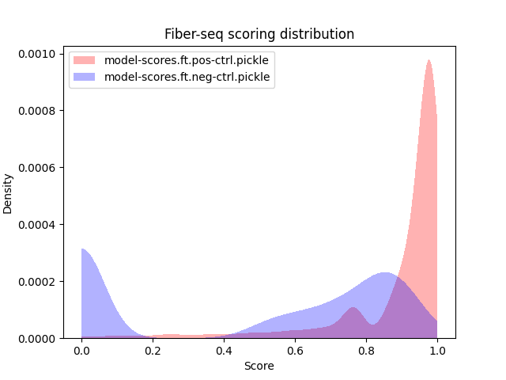

# cawlr 𓅨

[](./LICENSE)

**C**hromatin **a**ccesibility **w**ith **l**ong **r**eads (`cawlr`) is a tool for detecting accessible regions of chromatin on single molecules. The tool works with nanopore data via [`nanopolish`](https://github.com/jts/nanopolish) or modification data from third-party tools in BAM files.

<!-- TODO or PacBio data via [`kineticsTools`](https://github.com/PacificBiosciences/kineticsTools). -->

`cawlr` is flexible and can work with data that uses various modifications for chromatin accessibility detection. Outputs of all `cawlr` modules are in Apache Arrow format can be manipulated via any programming language that has an [Apache Arrow](https://arrow.apache.org/install/) library. Furthermore, `cawlr` includes various scripts for plotting and evaluating the results.

## Table of Contents

- [cawlr 𓅨](#cawlr-𓅨)
  - [Table of Contents](#table-of-contents)
  - [Quick Start](#quick-start)
    - [Nanopore R9.4 data](#nanopore-r94-data)
    - [Modification BAM input](#modification-bam-input)
  - [Installation](#installation)
    - [Installing rust via rustup](#installing-rust-via-rustup)
    - [Installing system dependencies](#installing-system-dependencies)
    - [Installing cawlr](#installing-cawlr)
      - [Docker (recommended)](#docker-recommended)
      - [Latest from git](#latest-from-git)
  - [Nanopore data preparation](#nanopore-data-preparation)
  - [Pipelines](#pipelines)
    - [Docker vs native](#docker-vs-native)
    - [`cawlr pipeline train-ctrls`](#cawlr-pipeline-train-ctrls)
      - [Inputs](#inputs)
    - [`cawlr pipeline preprocess-sample`](#cawlr-pipeline-preprocess-sample)
    - [`cawlr pipeline analyze-region`](#cawlr-pipeline-analyze-region)
    - [`cawlr` with BAM files with modification data](#cawlr-with-bam-files-with-modification-data)
      - [Requirements](#requirements)
  - [Plotting Scripts](#plotting-scripts)
    - [Plot scoring distribution](#plot-scoring-distribution)
      - [](#)
      - [Example Scoring Distribution Command](#example-scoring-distribution-command)
      - [Example Scoring Distribution plot](#example-scoring-distribution-plot)
    - [Clustering single molecule reads](#clustering-single-molecule-reads)
      - [Usage](#usage)
      - [Example Clustering Command](#example-clustering-command)
      - [Example Clustering plot](#example-clustering-plot)
  - [Citations](#citations)

## Quick Start

### Nanopore R9.4 data

```bash
$ cawlr pipeline train-ctrls -g genome.fa --pos-fast5 pos-fast5s/ --pos-reads pos.fastq --neg-fast5 neg-fast5s/ --neg-reads neg.fastq --output-dir training-output -m "2:GC"
$ cawlr pipeline preprocess-sample -g genome.fa --reads sample.fastq --fast5 sample-fast5s --summary /path/to/sequencing_summary.txt -o preprocessed/
$ cawlr pipeline analyze-region -l "chrI:1000-2000" -b sample.bam
```

<!-- ```bash
# Follow preparing data from Nanopore Data Preparation
$ nanopolish eventalign --read sample.fastq \
    --bam sample.bam --genome ref.fa \
    --scale-events --samples \
    --print-read-names --progress \
    -t 4 | cawlr collapse \
    --bam sample.bam --output sample.collapse.arrow
$ cawlr score -g ref.fa --pos-ctrl pos.model.pickle --neg-ctrl neg.model.pickle \
    -i sample.collapse.arrow -o sample.score.arrow
$ cawlr sma --pos-ctrl-scores pos.scores.pickle --neg-ctrl-scores neg.scores.pickle \
    -i sample.score.arrow -o sample.sma.bed
# TODO The rest of the commands
``` -->

### Modification BAM input

```bash
# Assume you have BAM files with modification calls with the A+Y tag
# pos.bam = positive control
# neg.bam = negative control
# sample.bam = sample, in vivo treated
$ cawlr model-scores -t "A+a" -i pos.bam -o pos.model-scores.pickle
$ cawlr model-scores -t "A+a" -i neg.bam -o neg.model-scores.pickle
# Visualize scoring distribution
$ plot_scoring_dist.py -i pos.model-scores.pickle neg.model-scores.pickle -o scoring_dist.png
$ samtools view -b sample.bam "chrI:1000-2000" >region.bam
# region.bed output can be visualize in the Genome Browser
$ cawlr sma -t "A+a" -i region.bam --pos-ctrl-scores pos.model-scores.pickle --neg-ctrl-scores neg.model-scores.pickle -o region.bed
# Visualize clusters
$ cluster_region.py -i region.bed -s 1000 -e 2000 -p 0.8 -n 3 --suptitle "My Region"
```

## Installation

### Installing rust via rustup

It is recommended to install the Rust compiler is through [rustup.rs](https://rustup.rs/).

### Installing system dependencies

Ensure you have these installed on your system before installing.

- make
- openblas
- perl
- gcc
- gfortran

### Installing cawlr

#### Docker (recommended)

```bash
docker pull bsaintjo/cawlr:full
```

#### Latest from git

```bash
git clone https://github.com/bsaintjo/cawlr-rs.git
cd cawlr-rs
cargo install --path .
```

## Nanopore data preparation

In order to prepare data for `cawlr` you need to install the following tools. These are provided in the docker image and the versions of the tools that `cawlr` is tested with are listed in parentheses.

- `guppy (v6.1.7)`
- [`samtools (v1.16)`](http://www.htslib.org/)
- [`nanopolish (v0.13)`](https://github.com/jts/nanopolish)
- [`minimap2 (v2.24)`](https://github.com/lh3/minimap2)

Example command of running nanopolish to set up inputs

```bash
$ nanopolish index -d path/to/fast5 reads.fasta
$ minimap2 -ax map-ont --sam-hit-only --secondary=no genome.fasta reads.fasta | \
    samtools sort -o aln.sorted.bam -T reads.tmp
$ samtools index aln.sorted.bam
$ nanopolish eventalign --reads reads.fasta \
    --bam aln.sorted.bam \
    --genome genome.fasta \
    --scale-events --samples \
    --print-read-names >eventalign.txt
```

<!-- TODO Confirm that cawlr collapse will fail without `--sam-hit-only` -->

For training the models, its good practice to avoid using multiple alignments for the same read.
To avoid this, you can filter the bam files with the command below before running `nanopolish`. The command filters with the `-f 20` to filter out reads with a MAPQ below 20, and `-F 0x900` removes supplementary and secondary reads as well.

```bash
# After minimap2 command
$ samtools view -b -q 20 -F 0x900 aln.sorted.bam >filtered.aln.sorted.bam
```

Once completed you can confirm that alignments have been filtered correctly with:

```bash
samtools flagstats filtered.aln.sorted.bam
```

## Pipelines

### Docker vs native

Pipelines will perform mapping and signal alignment so they must have access to binaries for `samtools`, `minimap2` and `nanopolish`. In the docker container, these binaries are already installed and in the `PATH`. If running the pipelines not within the docker container, these binaries need to be either located in the `PATH` or pass the paths to the pipeline tools using `--samtools-path`, `--minimap2-path`, and `--nanopolish-path`.

### `cawlr pipeline train-ctrls`

#### Inputs

- `--genome`
  - Path to genome fasta file
- `--pos-fast5`
  - Directory of basecalled fast5 files for positive control
- `--pos-reads`
  - Directory or single file containing basecalled reads
- `--pos-summary`
  - Patht to `sequencing_summary.txt` file from `guppy` output. Not required but will significantly speed up indexing.
- `--neg-fast5`
  - Directory of basecalled fast5 files for negative control
- `--neg-reads`
  - Directory or single file containing basecalled reads
- `--neg-summary`
  - Patht to `sequencing_summary.txt` file from `guppy` output. Not required but will significantly speed up indexing.
- `--motifs`
  - List of motifs of modified based to filter on
  - Format is `{1-based index}:{context}`, separated by commas
    - Example for GpC and CpG positions: `"2:GC,1:CG"`

### `cawlr pipeline preprocess-sample`

### `cawlr pipeline analyze-region`

### `cawlr` with BAM files with modification data

The `cawlr` tool is able to work with BAM files that contain modification data through the MM and ML tags. This is useful if you are using third-party tools such as [`megalodon`](https://github.com/nanoporetech/megalodon) or [Pac-Bio based tools](https://github.com/PacificBiosciences/primrose).

#### Requirements

File names in example representing requirements is shown in parentheses

- BAM files for positive/negative control (`pos.bam`/`neg.bam`)
- BAM file for sample of interest (`sample.bam`)
- Tag for the modification (`C+m` for cytosine methylation)
  - Currently `cawlr` only supports the modification calls on a single strand
  - For more information on the proper format, you can use `samtools view` to look for the specific tag or look at the [SAMtags specification](https://samtools.github.io/hts-specs/SAMtags.pdf)

```bash
$ cawlr model-scores -i pos.bam -t "C+m" -o pos-model-scores.pickle
$ cawlr model-scores -i neg.bam -t "C+m" -o neg-model-scores.pickle
$ cawlr sma \
  -i sample.bam \
  -t "C+m" \
  --pos-ctrl-scores pos-model-scores.pickle \
  --neg-ctrl-scores neg-model-scores.pickle \
  -o sample.bed
```

## Plotting Scripts

Plotting scripts are located in the `scripts/` directory. In the docker container, these scripts are in the `$PATH` and can be ran from the command line directly.

### Plot scoring distribution

Plot distribution of scores (ie probabilities of modification). This script takes as input python pickle files generated by `cawlr model-scores`. Useful for quickly checking visually how well the models will perform nucleosome calling.

####

```bash
$ plot_scoring_dist.py -h
usage: plot_scoring_dist.py [-h] [-i INPUT [INPUT ...]] [-o OUTPUT] [-t TITLE]

optional arguments:
  -h, --help            show this help message and exit
  -i INPUT [INPUT ...], --input INPUT [INPUT ...]
                        Score files to plot distribution
  -o OUTPUT, --output OUTPUT
                        Output filename
  -t TITLE, --title TITLE
                        Title of the output figure
```

#### Example Scoring Distribution Command

In this example, assume you have two pickle files from `cawlr model-scores` from positive and negative controls, `pos-model-scores.pickle` and `neg-model-scores.pickle` respectively.

```bash
plot_scoring_dist.py -i pos-model-scores.pickle neg-model-scores.pickle -o scoring_dist.png -t "My Custom Title"
```

#### Example Scoring Distribution plot



### Clustering single molecule reads

This will perform K-Means clustering on the nucleosome calls and plot each cluster separately. The input is a bed file that comes from `cawlr sma`. You can filter based on what percent of a read covers a given locus and choose the number of clusters.

NOTE: The bed file should from a subset of the bam that you are planning on visualizing. For example, if using a BAM file input, the BAM file should be subset with `samtools view example.bam chrA:1000-2000` as an example if you plan to visualize chromosome A, position 1000 to 2000.

#### Usage

```bash
$ cluster_region.py -h
usage: cluster_region.py [-h] -i INPUT -s START -e END [-p PCT] [-n N_CLUSTERS] [--suptitle SUPTITLE]
                         [--highlight [HIGHLIGHT ...]]

optional arguments:
  -h, --help            show this help message and exit
  -i INPUT, --input INPUT
                        Input bed file, usually from cawlr sma
  -s START, --start START
                        Start of region
  -e END, --end END     End of region
  -p PCT, --pct PCT     Perecent of the region that should be covered for a read to be valid
  -n N_CLUSTERS, --n-clusters N_CLUSTERS
                        Number of clusters
  --suptitle SUPTITLE   Figure title
  --highlight [HIGHLIGHT ...]
                        Highlight particular regions, usually gene bodies, etc., format is usually {start}-{end}:{strand}
```

#### Example Clustering Command

```bash
cluster_region.py
```

#### Example Clustering plot

.png)

## Citations

Parts of the code have been adapted from [NP-SMLR](https://github.com/imatrm/NP-SMLR) package
